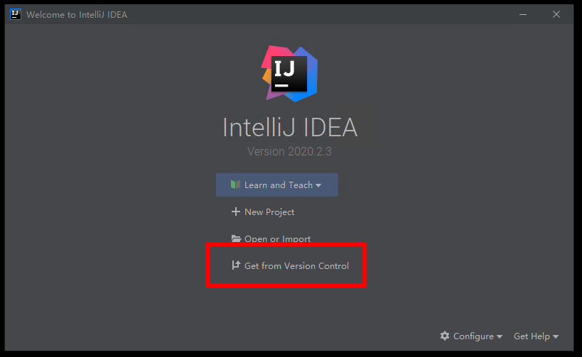
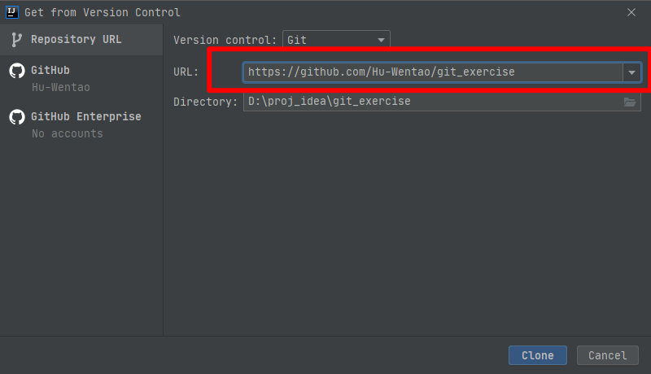

# git_exercise

Git协作练习项目

### 1 Git安装

进入Git官网 https://git-scm.com 下载对应安装包并打开，一路 next 即可完成安装

打开IDEA，Settings -> Version Control -> Git
在这里配置安装好的Git的路径，一般默认的路径即可，点击右侧的"Test"可以测试路径是否有效

### 3 在IDEA中启用Github <新版本IDEA无需该操作>

打开IDEA，Settings -> Version Control -> GitHub
点击左下角 "+" 将自己的Github账号添加到IDEA中

### 4 将本项目导入IDEA (图文版)

打开IDEA, 选择"Get from Version Control"

输入项目的git url, 点击 "clone" 即可克隆当前项目到本地

> 注意, 新版本的IDEA, 在URL 框中输入的git地址, 末尾不带".git"同样可以克隆(如下图所示)

