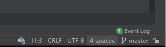
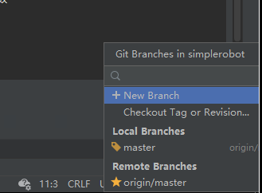
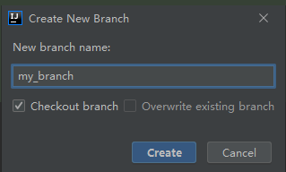
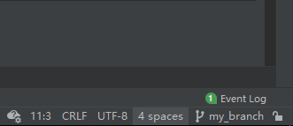

## 如何新建一个分支

1. 打开IDEA, 点击右下角 "分支图标", 图标右侧"master"表示当前分支名称

   

2. 选择 "+ New Branch", 来创建新的分支

   

3. 输入新的分支名称, 如"my_branch"

    

4. 点击"Create" 即可创建分支, 此时右下角显示已切换为 "my_branch"

    

## 如何移除已经 add到git中的文件 —— git rm <文件名>

1. 进入git所在目录， 使用 git status 查看已经add到git的文件
2. 找到想要取消add的文件，使用命令 git rm <文件名> -f 移除文件 ( f 表示 -force ）

